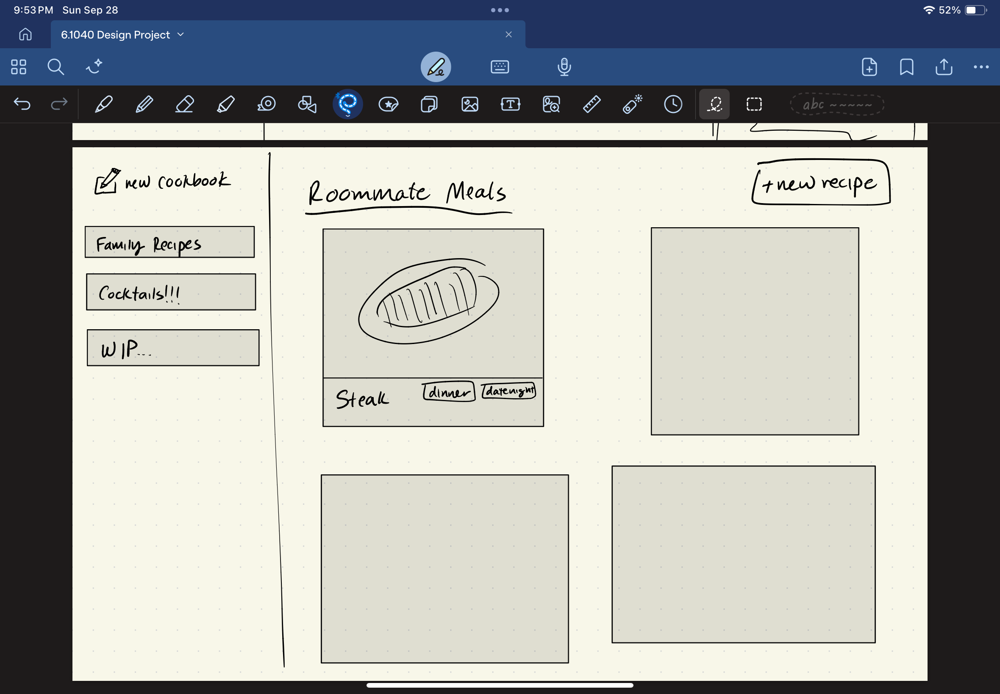
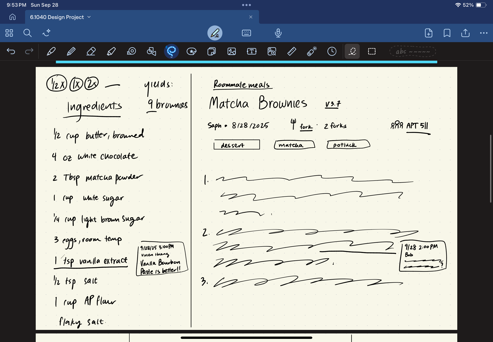
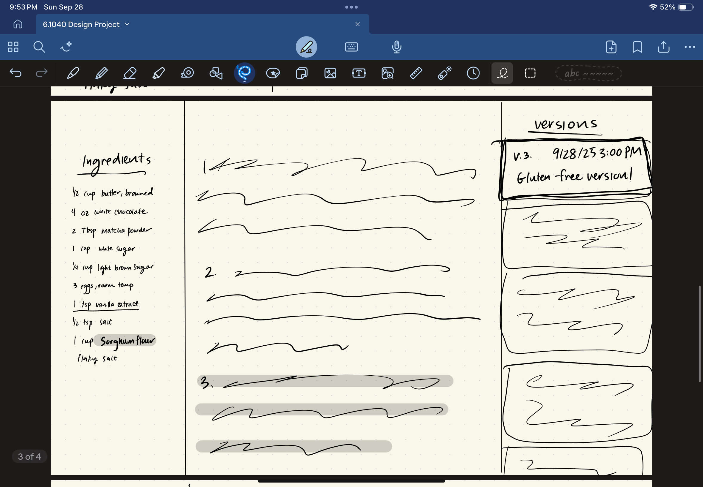

## Problem Statement

### Domain: Keeping Track of Recipes

Cooking has become an essential part of my daily life, first in a cook-for-yourself dorm and now living off-campus. My inspiration usually comes from friends or social media, but keeping these recipes organized has always been a struggle. Screenshots pile up in my camera roll, TikTok saves get buried, and text messages with recipes quickly disappear. I care about this domain because cooking is not just a necessity, but a creative and social activity — yet the messy way I track recipes undermines the joy and repeatability of it.

### Problem: Adding Notes on Recipes

When I adapt a recipe — for example, using less salt or adding more spice — I have no good way to record those tweaks for the future. Platforms like NYT Cooking and AllRecipes don’t prioritize personal annotation, and my own ad hoc methods (typing notes into my phone or scribbling on paper) are fragmented and hard to reuse. This means I often forget my adjustments, repeat mistakes, or fail to share reliable versions with friends. The result is wasted effort and lost opportunities to build on past cooking successes.

### Stakeholders

* **Home Cooks (Users)** – Regularly cook and want to save personalized tweaks to recipes.
* **Friends & Family** – Receive or share recipes and benefit from trusted, annotated versions.
* **Recipe Creators & Publishers** – Original authors whose work forms the foundation for user adaptations.

### Evidence & Comparables

* **College Students Cook Often** – Study shows students frequently cook, supporting demand for recipe management [link](https://www.sciencedirect.com/science/article/abs/pii/S1878450X21000020).
* **Cooking Education Boosts Skills** – Education increases cooking frequency, making recall of past tweaks even more valuable [link](https://pmc.ncbi.nlm.nih.gov/articles/PMC10563711/).
* **Home Cooking and Diet Quality** – Research links home cooking to better diets, so better note-taking supports health outcomes [link](https://pmc.ncbi.nlm.nih.gov/articles/PMC8728746/).
* **Food Waste Statistics – USDA** – Mistakes in cooking contribute to food waste; saving successful tweaks reduces waste [link](https://www.usda.gov/foodwaste/faqs).
* **NYT Cooking Notes** – Shows annotation demand, but limited to one ecosystem [link](https://cooking.nytimes.com/).
* **Paprika Recipe Manager** – Rich features but clunky sharing [link](https://www.paprikaapp.com/).
* **AnyList** – Strong for shared lists but not for evolving recipe notes [link](https://www.anylist.com/).
* **Samsung Food** – Focused on saving recipes, less on personal version history [link](https://www.samsungfood.com/).

---

## Application Pitch

### Name

**Nibble**

### Motivation

Cooks constantly tweak recipes — adjusting flavors, substituting ingredients, or modifying steps — but have no easy way to record and reuse those personal changes.

### Key Features

* **Inline Recipe Annotations** – Users can highlight specific ingredients or steps and attach notes (e.g., “use ½ tsp instead of 1 tsp salt”). This keeps improvements tied directly to the recipe, reducing the chance of repeating mistakes.
* **Version Control for Recipes** – Each time a user makes changes, the app saves a new version with notes on the outcome. This creates a living history of reliable variations while preserving the original recipe. Friends and family can easily adopt tested adaptations.
* **Shared Recipe Notebooks** – Users can collect and share annotated recipes in collaborative notebooks with friends or family. This fosters community cooking and ensures everyone benefits from each other’s tweaks, making group meals easier and more enjoyable.

**Nibble** empowers home cooks to build on their own experiences, reduce wasted effort, and share reliable recipes with others — turning messy screenshots and forgotten tweaks into a clear, evolving cooking journal.

Perfect—here’s a spec-style rewrite of your **Recipe App** concepts in the exact voice and structure of the **GiftRegistration** example, including explicit **requires** and **effects** for every action.

---

Awesome—here’s a tight, spec-style **Concept Design** for your recipe app that mirrors the GiftRegistration format exactly. You’ve got **4 concepts** (within the 3–5 target), each with **purpose, principle, state, and actions** using explicit **requires/effects**. Then a set of **essential synchronizations**, and finally a **brief note** explaining roles and generic instantiations.

---

# Concept Specifications (Standard Form)

## concept Recipe [User, Ingredient, Step, Tag]

**purpose** track original recipes and serve as the base for annotation, sharing, and versioning
**principle**
a cook creates a recipe with a title, ingredients, and steps;
adds optional tags for discovery;
shares the recipe into notebooks for collaboration;
and keeps the original stable while annotations and versions accumulate around it.

**state**
a set of Recipes with

* an owner User
* a title String
* a list of Ingredients
* a list of Steps
* a set of Tags
* a set of Annotations
* a set of Versions
* a set of Notebooks (shares)

**actions**
createRecipe (owner: User, title: String, ingredients: List[Ingredient], steps: List[Step]): (recipe: Recipe)
 requires owner exists, title nonempty, ingredients and steps well-formed
 effects create a new recipe with this owner, title, ingredients, steps, empty tags/annotations/versions and no shares

addTag (recipe: Recipe, tag: Tag)
 requires recipe exists
 effects add tag to recipe’s tag set

removeTag (recipe: Recipe, tag: Tag)
 requires recipe exists and tag ∈ recipe.tags
 effects remove tag from recipe’s tag set

deleteRecipe (requester: User, recipe: Recipe)
 requires recipe exists and requester = recipe.owner
 effects remove recipe from any shared notebooks; delete all versions and annotations belonging to recipe; delete recipe

## concept Annotation [User, Recipe]

**purpose** let cooks attach contextual notes to a specific ingredient or step without mutating the original recipe
**principle**
a user may highlight an ingredient or step and record a note;
annotations are visible wherever the recipe is visible;
and they may later be edited, resolved, or removed.

**state**
a set of Annotations with

* an author User
* a recipe Recipe
* a target Kind ∈ {Ingredient, Step}
* a targetIndex Number
* a text String
* a created DateTime
* a resolved Flag

**actions**
annotate (author: User, recipe: Recipe, target: Kind, index: Number, text: String): (annotation: Annotation)
 requires recipe exists; author can view recipe; text nonempty; if target = Ingredient then 0 ≤ index < |recipe.ingredients|; if target = Step then 0 ≤ index < |recipe.steps|
 effects create a new annotation with resolved = false and add it to recipe.annotations

editAnnotation (author: User, annotation: Annotation, newText: String)
 requires annotation exists and author = annotation.author and newText nonempty
 effects set annotation.text := newText

resolveAnnotation (resolver: User, annotation: Annotation, resolved: Flag)
 requires annotation exists and resolver can view annotation.recipe
 effects set annotation.resolved := resolved

deleteAnnotation (author: User, annotation: Annotation)
 requires annotation exists and author = annotation.author
 effects remove annotation from its recipe and delete it

## concept Version [User, Recipe, Ingredient, Step]

**purpose** capture concrete modifications to a recipe as an immutable snapshot, preserving a history of outcomes
**principle**
a user derives a version from a base recipe;
the version records its own ingredients, steps, notes, and author;
multiple versions may coexist to reflect forks or alternatives.

**state**
a set of Versions with

* a recipe Recipe
* a number String (e.g., “3.7”)
* an author User
* a notes String
* a list of Ingredients
* a list of Steps
* a created DateTime

**actions**
createVersion (author: User, recipe: Recipe, number: String, notes: String, ingredients: List[Ingredient], steps: List[Step]): (version: Version)
 requires recipe exists; author can view recipe; number not used by any existing version of this recipe; ingredients and steps well-formed
 effects create a new version linked to recipe with provided fields; add to recipe.versions

deleteVersion (requester: User, version: Version)
 requires version exists and (requester = version.author or requester = version.recipe.owner)
 effects remove version from recipe.versions and delete it

## concept Notebook [User, Recipe]

**purpose** provide collaborative collections where members can view, organize, and contribute to recipes and their versions
**principle**
an owner creates a notebook;
invites members;
and shares recipes into the notebook so all members can view the recipe, its versions, and annotations.

**state**
a set of Notebooks with

* an owner User
* a title String
* a set of Members (Users)
* a set of Recipes

**actions**
createNotebook (owner: User, title: String): (notebook: Notebook)
 requires owner exists and title nonempty
 effects create a new notebook with this owner, empty members (or owner implicitly a member), and no recipes

inviteMember (owner: User, notebook: Notebook, member: User)
 requires notebook exists and owner = notebook.owner
 effects add member to notebook.Members

removeMember (owner: User, notebook: Notebook, member: User)
 requires notebook exists and owner = notebook.owner and member ∈ notebook.Members
 effects remove member from notebook.Members

shareRecipe (sharer: User, recipe: Recipe, notebook: Notebook)
 requires recipe and notebook exist; sharer can share recipe (sharer = recipe.owner or sharer ∈ notebook.Members and recipe.owner ∈ notebook.Members)
 effects add recipe to notebook.Recipes and add notebook to recipe.Notebooks

unshareRecipe (requester: User, recipe: Recipe, notebook: Notebook)
 requires recipe and notebook exist and recipe ∈ notebook.Recipes and (requester = recipe.owner or requester = notebook.owner)
 effects remove recipe from notebook.Recipes and remove notebook from recipe.Notebooks

---

# Synchronizations

**sync: recipe sharing surfaces versions and annotations**
when shareRecipe adds a recipe to a notebook
requires recipe and notebook exist
effects all notebook.Members gain view permission to recipe, recipe.versions, and recipe.annotations

**sync: notify on new version**
when createVersion creates a version and recipe ∈ some notebook.Recipes
effects notify all members of those notebooks except the author with (recipe, version.number, version.notes)

**sync: guard annotation target indices**
when createVersion creates a version
effects does not change existing annotations’ target indices (they continue to refer to the base recipe); UI diffing may highlight drift (out of scope of state)

**sync: cascade deletes**
when deleteRecipe deletes a recipe
effects delete all versions and annotations linked to that recipe and unshare it from any notebooks

**sync: member access**
when inviteMember adds a member to a notebook
effects the new member can view all recipes currently in the notebook and any added later

---

# Notes

These four concepts separate concerns cleanly. **Recipe** is the canonical content unit (ownership, ingredients, steps, tags). **Annotation** overlays personal and collaborative insight without mutating the original recipe. **Version** records concrete, reproducible modifications and outcomes as immutable snapshots, enabling parallel forks and history. **Notebook** scopes collaboration and access: owners manage membership, and sharing a recipe to a notebook confers view rights—propagated by synchronization—to its versions and annotations.

**Access control** is enforced primarily through **Notebook** membership; actions that read or write to Recipe, Version, or Annotation require the actor to be the recipe owner, the version author, or a member of a notebook that contains the recipe, as specified in each action’s `requires`. This keeps authorization logic declarative and centralized via syncs.

**Generic parameters** instantiate as follows:

* `User` binds to application users (accounts).
* `Ingredient` and `Step` are recipe-structured items (your app’s data types).
* `Tag` is a lightweight label type (string or tagged object).
* `Kind` (Ingredient | Step) is defined within Annotation to locate targets precisely.

This design gives you a minimal, orthogonal surface (4 concepts) with explicit preconditions/effects, while the synchronizations encode the cross-cutting ideas (sharing → access, version creation → notification, and lifecycle cascades).

## User Journey

**Trigger**
It’s a Sunday afternoon, and Vivien and her roommates want to bring dessert to a potluck. They remember that their friend Saph had made *Matcha Brownies* before and saved the recipe in their shared cookbook. Rather than searching through screenshots or old texts, they open the app.

---

**Step 1: Browsing the Cookbook**

Vivien navigates to the **Cookbook View**.. In the sidebar, she sees all her cookbooks — *Family Recipes*, *Cocktails!!!*, and *WIP…*. She clicks on *Roommate Meals*, which opens up a grid of recipe cards. Alongside their *Steak* dinner recipe, she spots *Matcha Brownies*, tagged as *dessert, matcha, potluck*. The tags make it easy to find the right recipe for the occasion.

---

**Step 2: Opening the Recipe**

Clicking on the card brings Vivien into the **Recipe View** (see *Recipe View sketch*). The recipe title *Matcha Brownies* is at the top, with the header showing it belongs to *Roommate Meals*. The version number reads **3.7**, authored by *Saph* on *8/28/2025*, and the recipe is forked twice. To the right, she sees it’s currently shared with their apartment group *APT 511*.
Scrolling down, Vivien notices a previous comment she made on the ingredient *“1 tsp vanilla extract”* — *“Vanilla Bourbon Paste is better!!!”* (9/28/2025). There’s also a question annotation from their friend Bob on one of the steps. These embedded notes remind the group of personal tweaks and open discussions, instead of cluttered chats.

---

**Step 3: Exploring the Version History**

Before baking, Vivien clicks into the **Version View** (see *Version View sketch*). On the right-hand panel, she sees *Version 3.7 — “Gluten-Free version!”* created earlier that day. The highlights in the ingredient and recipe sections make the changes clear compared to the previous version — a different type of flour, slight adjustments in baking time. Now Vivien can decide whether to use the gluten-free fork or stick with the standard recipe.

---

**Step 4: Cooking and Contributing**
The roommates follow the gluten-free version for the potluck. After baking, Vivien clicks “+ New Version” to record their outcome. She tags it as *potluck hit* and notes, *“Cut sugar by 20%, still delicious.”* This becomes Version 3.8, instantly visible in the *Roommate Meals* cookbook for everyone in APT 511.

---

**Outcome**
Instead of repeating old mistakes or losing track of tweaks, Vivien and her roommates have a shared, evolving record of their favorite recipes. Annotations capture tips and questions, version history highlights adaptations, and cookbooks organize everything by context. What once was a messy thread of screenshots is now a collaborative cooking journal that makes group meals smoother and more fun.

